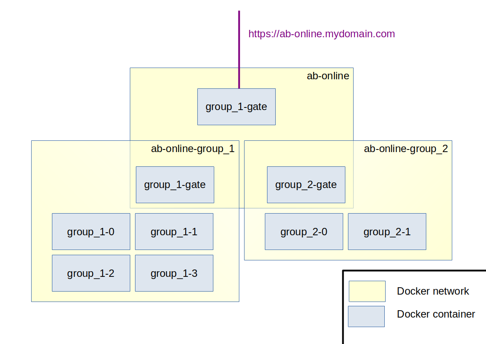

# Activity Browser Online

Launch reproducible [Activity Browser](https://github.com/LCA-ActivityBrowser/activity-browser) sessions and distribute them using NoVNC.

**This project is a personnal work. It is not maintained by the Activity Browser team.**

## Contents

- [Quickstart](#quickstart)
- [What is Activity Browser Online ?](#what-is-activity-browser-online)
- [How does it work ?](#how-does-it-work)

## Quickstart

- install Activity Browser Online with conda:

```bash
conda install -c pan6ora -c conda-forge ab-online
```

- ensure that you have Docker configured in your session
- start the example session by running:

```
ab_online session start example
```

- let docker build images and start containers, then check that containers are up and running with `docker ps --format="{{.Image}}\t{{.Names}}\t{{.Status}}"` which should return something like:

```
ab-online/local:example	example-0	    Up 1 minute
ab-online/novnc:latest	example-gate	Up 1 minute
```

- connect to the only machine of this session at: `http://localhost:8080/vnc.html?resize=remote&path=novnc/websockify?token=0`

## What is Activity Browser Online ?


## How does it work ?

The system is build around docker containers.

**docker containers**

**sessions**

A session is described in a json files. This file describes how many machines to launch and the Activity Browser configuration :
- projects to create
- databases to import in projects
- plugins to activate in projects

See [Sessions documentation](#sessions) for more infos.


s
- A main gate containing :
    - a proxy to manage authentification
    - a NoVNC client to connect to machines
    - a login web interface
    - an admin panel to manage machines and sessions
- "Machines" containers :

The following scheme is an example with two sessions started.



## Documentation

### sessions
