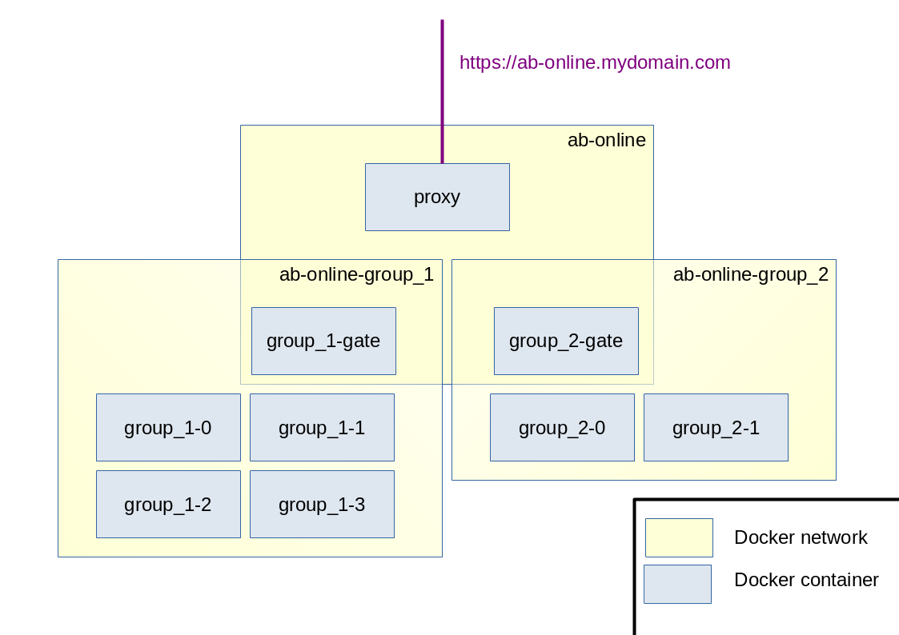

# How does it work ?

## machine

A machine is an environment running Activity Browser and accessible through NoVNC. 
It can be seen as a virtual machine that one user can connect to.

## sessions

Sessions are used to define machines content. 

A session is described in a json files. This file describes how many machines to launch and the Activity Browser configuration :
- projects to create
- databases to import in projects
- plugins to activate in projects

See sessions documentation for more infos.

## docker containers

- Each user machine is a docker container with Activity Browser installed and setup.
- Each session has also a container with a NoVNC client.
- On top of that, a container with a proxy manage login.

The following scheme is an example with two sessions started:

## authentication

The authentication is managed at a session level